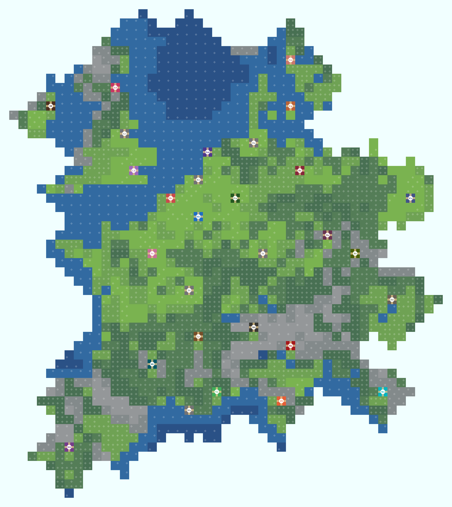

## Train Conductor World Map

**[Train Conductor World][tcw]** is mobile game (for [iOS][ios] and [Android][and]) by [The Voxel Agents][tva].
The game has several cities on a world map (currently, only European cities).

This repository (forked from [a GitHub Gist][gist]) is an effort to replicate the game world map outside the game, and to help plan in-game routes, such as with [Train Conductor World Tools][tcwt]

[Tiled Map Editor][tiled] was used to rebuild the map, and [ImageMagick][im] to automatically generate the graphics.

## Assets

### Files

#### `map.png`
The exported map generated by [Tiled][tiled] from `train-conductor-world.tmx`

#### `tiles.csv`
A sheet exported from [Google Sheets][sheet] which details information on each tile.

Note that `Column Name` and `Data Type` are respectively stored in the first and second row.

| Column Name        | Data Type     | Description |
| ------------------ | ------------- | ----------- |
| `Abbreviation`     | `string`      | A shorter form of the tile name; for an `Environment` this is an emoji; for a `Location`, a two letter abbreviation; for a `Track` or `Connection`, a [Unicode Box-drawing character][unicode] where the heavy side denotes which direction has a branch. 
| `Name`             | `string`      | The name of the tile, where given. For `Track`s and `Connection`s, this was inspired from the Unicode name of the `Abbreviation`, omitting "Heavy" and "Light" by denoting the direction before the "and" as the one with two tracks. For `Location` and `Environment`, this was taken from the game. 
| `Color`            | `string`      | The [hex color code](#artwork) for the tile denoted as `#rrggbb`. Used by `generate_tiles.sh` 
| `Group`            | `string`      | The group the tile belongs to. Either `Environment`, `Location`, `Track`, or for artistic purposes, `Connection`.
| `Type`             | `string`      | The type of tile within the group; for an `Environment`, whether it's `Sparse` or `Dense`; for a `Location`, whether it's a `City` or `Port`; for a `Track`, whether it's `Wood`, `Iron`, `Alloy`, or for artistic purposes, `Transparent`; for a `Connection`, which `City` it belongs to. 
| `Filename`         | `string`      | A sorting and path friendly name for the tile, generated by replacing ` ` with `_`, padding numbers, and joining the `Id`, `Group`, `Group Id`, `Type`, and `Name` by `-`, followed with `.png`. 
| `Id`               | `integer`     | The id of the tile starting from 0, which can be used to read `map.csv`. 
| `Tmx Id`           | `integer`     | The id of the tile starting from 1, which can be used to read the CSV embedded inside `train-conductor-word.tmx` 
| `Group Id`         | `integer`     | The id of the tile starting from 0, used to dictate the order of groups. 
| `Height`           | `integer`     | The layer height of a `Environment` where `0` is the lowest. 
| `Connection Color` | `string`      | The [hex color code](#artwork) for the connection of a `City`, denoted as `#rrggbb`. 
| `X`                | `integer`     | The x coordinate[^1] of a `Location`.
| `Y`                | `integer`     | The y coordinate[^1] of a `Location`.
| `Overlays`         | `list`[^2]    | The names of any `Environment`s that a `Track` can build on. 
| `Speed`            | `float`       | The speed multiplier that a `Track` provides for connections. 
| `Branching`        | `boolean`[^3] | Whether a `Track` or `Connection` contains a branch. 
| `Branches`         | `integer`     | The number of branches of a `Track` or `Connection`. 
| `Vertical`         | `boolean`[^3] | For a `Track` or `Connection`, whether it has a connection from top to the bottom. 
| `Horizontal`       | `boolean`[^3] | For a `Track` or `Connection`, whether it has a connection from left to right. 
| `Up Right`         | `boolean`[^3] | For a `Track` or `Connection`, whether it has a connection from the top to the right. For an `Environment`, used by `generate_tiles.sh` to determine whether to draw a shape in the top right corner. 
| `Down Left`        | `boolean`[^3] | For a `Track` or `Connection`, whether it has a connection from the bottom to the left. For an `Environment`, used by `generate_tiles.sh` to determine whether to draw a shape in the bottom left corner.
| `Down Right`       | `boolean`[^3] | For a `Track` or `Connection`, whether it has a connection from the bottom to the right. For an `Environment`, used by `generate_tiles.sh` to determine whether to draw a shape in the bottom right corner.
| `Up Left`          | `boolean`[^3] | For a `Track` or `Connection`, whether it has a connection from the top to the left. For an `Environment`, used by `generate_tiles.sh` to determine whether to draw a shape in the top left corner.
| `Up`               | `boolean`[^3] | Whether a `Track`, `Location`, or `Connection` has a track on the top. 
| `Right`            | `boolean`[^3] | Whether a `Track`, `Location`, or `Connection` has a track on the right. 
| `Down`             | `boolean`[^3] | Whether a `Track`, `Location`, or `Connection` has a track on the bottom. 
| `Left`             | `boolean`[^3] | Whether a `Track`, `Location`, or `Connection` has a track on the left. 

[^1]: From the top left corner, starting from 0, where `X` increases rightwards and `Y` increases downwards.
[^2]: Stored as a quoted `string` separated with `, `. e.g. `"Grass, Forest, Water"`.
[^3]: Since the CSV was managed in Google Sheets, a `boolean` value in `tiles.csv` will be either `TRUE` or `FALSE`

#### `tiles.json`
Stores the data from `tiles.csv` in a more computer readable format.

#### `train-conductor-world.tmx`
The file storing the map and tile data, which can be easily edited or viewed using [Tiled][tiled].

#### `achievements.json`
Originating from [here][achievements], this file lists the achievements of the game in a computer readable format.

#### `tiles_csv_to_json.py`
A script that acknowledges the `Data Type`s of `tiles.csv` and converts it to `tiles.json`, removing any missing values.

#### `generate_tiles.sh`
The script uses [ImageMagick][im] to generate pixel artwork for the tiles given `tiles.csv`.

On normal execution, the script will perform as follows, only generating files if they don't already exist:

1. `generate_straight_track`
    1. `generate_straight_planks`
        * Draws planks distributed across the tile.
    1. `generate_straight_rails`
        * Draws rails at a fixed ratio from the center.
1. `generate_curve_track`
    1. `generate_curve_planks`
        * Applies a polar distortion map to curve the given straight planks.
    1. `generate_curve_rails`
        * Applies a polar distortion map to curve the given straight rails.
1. `generate_straight_connection`
    * Draws a connection similarly to `generate_straight_track`.
1. `generate_curve_track`
    * Draws a connection similarly to `generate_curve_track`.
1. `generate_from_csv`
    1. `generate_environment`
        * Overlays one to four diamonds on a square of a given background color.
    1. `generate_location`
        * Overlays (from top to bottom):
            1. A colored two letter abbreviation of the location name in serif font.
            1. A white circle.
            1. A horizontal and vertical track.
            1. A background colored with the same color as the two letter abbreviation.
    1. `generate_track`
        * Overlays (from top to bottom):
            1. The set of rails which produce the track.
            1. The set of planks which produce the track.
            1. A background of a given color.
    1. `generate_connection`
        * Overlays the set of connections which produce the connection.
        * Applies the color of the connection.

#### `tests.py`
A `Python 3` script that runs tests to ensure correctness after editing.

#### `screenshots`
* A folder of screenshots which was used as the basis for generating the graphics and information such as:
  * The ordering of the track tiles.
  * The dimensions and specifications of the tiles.
  * The arrangement of the map.
* All other information was taken from the game's FAQ, Announcements, and it's [Facebook page][fb].
* There are 4 seasonal folders (`summer`, `autumn`, `winter`, `spring`), each with two sub folders (`editor` and `viewer`), which each containing an up close, cropped screenshot of the artwork of each tile for a given season and view.
* The `tracks` directory contains a collection of cropped screenshots of different types of tracks from opening track boxes.
* The `cities` directory contains a collection of cropped screenshots of all the cities in the editor view, selected so that their connections colors are highlighted.
* The `other` directory contains miscellaneous cropped screenshots where:
  * `port.png` is a cropped picture from an [online screenshot][opss] on the [google play store][and]  that details the look of the older ports and was used to determine the background color of the port tiles.
  * `track-ordering.png` is a cropped and combined screenshot of the order of tracks in the editor.
  * `missing-track-order-facebook.jpg` is a screenshot from a [post on facebook][fbss] that was used to approximate the order of missing track tiles from `track-ordering.png`
  * `track-background-color.png` is a cropped screenshot of a Wood, Iron, and Alloy, Down and Right track, put together side by side, and was used to determine the background color of those respective track tiles.
  * `map-collage.png` a stitched collection of cropped screenshots of the original map in editor view.
* There are also additional [screenshots][ss] as mentioned in the [gist][gist].

### Artwork
* The art in the `tiles` directory was generated using `generate_tiles.sh`.
* Although the tiles themselves do not have square proportions, making them square makes them easier to work with.
* Due to the non-square proportions of the tiles, vertical track tiles are found to have 6 planks, while horizontal track tiles are found to have 7 planks, and curved track tiles are found to have 5.
* A pixel size of 64 was used as it was the the smallest reasonable factor of 2, but mainly because it was the one originally set in the [gist][gist]. Any reasonable factor of 6 could also be used to generate tracks with a number of planks closer matching to the game.
* A Track's background color was taken from `track-background-color.png` by calculating the average color of the background without rails or planks using [Gimp][gimp]. Their plank and rail colors were taken from the screenshots in the `tracks` directory.
* A City's background color was determined by picking the color of its circle on the ground, from the screenshots in the `cities` directory.
* A City's connection color was determined by picking the color of the line appearing from the city when selected in the editor, from the screenshots in the `cities` directory.
* For Ports, the format of the original port tile artwork is being used (being very similar to cities) as it is more descriptive than the current port tile. All their background colors are the same and were taken from `other/port.png`.
* An Environment's background color was determined by the dominating background color of the tile screenshots in the `summer/editor` directory.

### Tiles
The `tiles` directory stores all the images required for `train-conductor-world.tmx`

#### Environments
There are 5 different environment tiles, of which some have different styles of graphics between themselves, and again depending on the season.

##### Clouds
* Cloud tiles only have one graphic and cannot be built upon.
* They act as the border of the game, and are the highest positioned tile.
* Due to the 3D aspect of the normal view, it is possible to see which tiles could be underneath Clouds at the edges of the map, however this was not considered when creating the map.

##### Water
* Water tiles have two graphics, with one being darker than the other.
* They can only be built on by non-branching Alloy tracks.
* They are the lowest level positioned tile.

##### Grass
* Grass tiles have two sets of graphics.
  * The sparser set has two different graphics, and is positioned one level higher than Water.
  * The denser set also has two different graphics, and is positioned one higher than the other set of Grass tiles.
* They can be built on by any track.

##### Forests
* Forest tiles have two graphics, with one being denser than the other.
  * The sparser tile is positioned one higher than the denser set of Grass tiles.
  * The denser tile is positioned one level higher than the sparser Forest tile.
* They can be built on by Iron or Alloy tracks.

##### Mountains
* Mountain tiles have two graphics, with one being denser than the other.
  * The sparser tile is positioned one higher than the denser Forest tiles.
  * The denser tile is positioned one level higher than the sparser Mountain tile.
* They cannot be built upon.

#### Locations
As of January 2023, there are a total of 30 different locations in game.

A lot of the earlier details such as what order which locations were unlocked or released in are no longer easily found without restarting the game, however looking at the game's [version history][history], the determined order is:

1. Prague & Warsaw [[v1.3](https://www.ipa4fun.com/ipa/64334/)]
2. "UK & Scandinavia" (Assumed to be Copenhagen, Edinburgh, Gothenburg, Grimsby,  London) [[1.4](https://www.ipa4fun.com/ipa/68834/)]
3. Bernina [[v1.6](https://www.ipa4fun.com/ipa/81402/)]
4. Belfast [[v1.8](https://www.ipa4fun.com/ipa/92847/)]
5. Mostar [[v1.10](https://www.ipa4fun.com/ipa/106999/)]
6. Madrid [[v1.12](https://www.ipa4fun.com/ipa/124229/)]
7. Budapest [[v1.14.1](https://www.ipa4fun.com/ipa/267007/)]
8. Florence [[v19.0](https://www.ipa4fun.com/ipa/578209/)]

##### Cities
There are 24 playable cities:

* Amsterdam
* Bastei
* Belfast
* Berlin
* Bernina
* Bruges
* Budapest
* Cologne
* Copenhagen
* Edinburgh
* Florence
* Gothenburg
* London
* Lyon
* Madrid
* Matterhorn
* Millau
* Mons
* Mostar
* Paris
* Porto
* Prague
* Verdon
* Warsaw

##### Ports
There are 6 connectable ports:

* Dijon
* Grimsby
* Hamburg
* Marseille
* Rotterdam
* Stuttgart

Each port can connect up to 8 other cities, with each requiring keys which can be obtained by connecting to other cities with certain types of track tiles.

#### Tracks
It is believed[^4] that there are total of 42 track tiles, with 6 of them being Wood, 18 being Iron, and the remaining 18 being Alloy.

##### Wooden
* Wood track tiles are the default track tile.
* They can only be built on Grass tiles.
* There are 6 types of Wood track tiles. One for every curve, and one each for the vertical, and horizontal track tiles.

##### Iron
* Iron track tiles are the successors to Wood track tiles.
* They have a 1.3x speed multiplier for the connections of which they are a part of.
* They can only be built on Grass or Forest tiles.
* There are 18 Iron track tiles, of which:
  * 8 are the combination of every curve and straight track tile.
  * 4 are the combination of every curve track tile originating from the same point.
  * 6 take the same basic form as the [Wooden track tiles](#wooden).

##### Alloy
* Alloy track tiles are the successors to Iron track tiles.
* They have a 1.6x speed multiplier for the connections of which they are a part of.
* All Alloy track tiles can only can be built on Grass or Forest tiles, and all non-branching Alloy track tiles can be built on Water.
* There is good reason to believe that there are also 18 Alloy track tiles[^3], of which:
  * 8 are the combination of every curve and straight track tile.
  * 4 are the combination of every curve track tile and straight track tile which all connect to each other once to create a "triangle".
  * 6 take the same basic form as the [Wooden track tiles](#wooden).

##### Transparent
* Transparent track tiles do not exist in the game and were only created out of ease, for the purposes of using them as an asset in the map editor.
* Because of this, there are 22 transparent track tiles, being the union of every type of track tile.

[^4]: I have yet to see any Alloy track tiles which take the same form as the Iron double curve branched track tile through both collecting over 1000 tiles and through the tile trader. I suspect that even if someone were to collect these tiles and trade them in, they would be returned with the superior 3 connection Alloy version. This screenshot from [Facebook][fbss] also backs the theory.

#### Connections
* Connection tiles do not exist in the game, and only serve as a method of drawing connections between [cities](#cities) and [ports](#ports).
* There are a total of 414 connection tiles, with 18 for each of the 23 cities:
  * 6 take the same basic form as the [Wooden track tiles](#wooden).
  * 4 are the combination of every curve track tile originating from the same point.
  * 8 are the combination of every curve and straight track tile.
  * There are no "triangle" connections since a city's connection cannot loop on itself.

## TODO

### Artwork
* Draw a set of more artistic tiles to better match [in-game proportions][ss].
* Add a set of dark themed tiles.

### `generate_tiles.sh`
* Migrate to Python.
* Fix font size in location generation to work with up-scaling.
* Fix circle positioning and size in location generation to work with up-scaling.
* Assert all functions work without constants, for any dimensions.
* Rotate the drawing so that the original track is vertical.

[tcw]: http://trainconductorworld.com/
[tva]: http://www.thevoxelagents.com/
[and]: https://play.google.com/store/apps/details?id=com.thevoxelagents.tc3
[ios]: https://itunes.apple.com/app/id932228293
[gimp]: https://www.gimp.org/
[gist]: https://gist.github.com/denilsonsa/3644cafb33efbc4b54b6bd412c3a47e1
[tiled]: http://www.mapeditor.org/
[im]: https://imagemagick.org/
[ss]: https://imgur.com/a/Hkw8q
[sheet]: https://docs.google.com/spreadsheets/d/1i-rhz5iKwV1Owp1eVBdBemRP-VYzsT6pZjHN62mn3iM/edit?usp=sharing
[history]: https://www.ipa4fun.com/history/58499/
[achievements]: https://gist.githubusercontent.com/denilsonsa/3644cafb33efbc4b54b6bd412c3a47e1/raw/acde8dfa1ee50bf72db3dde5826b97de296d5a83/achievements.md
[characters]: https://en.wikipedia.org/wiki/Box_Drawing
[fbss]: https://www.facebook.com/photo/?fbid=6000382769979855&set=p.6000382769979855&__tn__=%2CO*F
[fb]: https://www.facebook.com/TrainConductorGame/
[unicode]: https://en.wikipedia.org/wiki/Box-drawing_character
[opss]: https://play-lh.googleusercontent.com/KQezcCnX6tzBYb_3PMf8F0ZA2xN3X4MaDPm1DzbQKJtaFe9W7ul6QL4rE1H7-D_Zkac=w720-h310-rw
[tcwt]: https://github.com/ekohilas/train-conductor-world-tools
